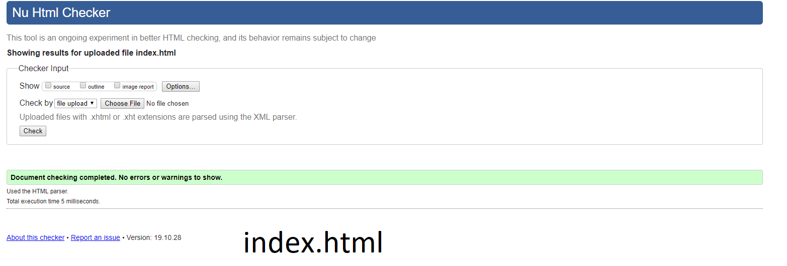

# FEWD_Treehouse-Project-1
All files are made for grading purposes only

Rubric Tasks
Project includes the following files: 
√ index.html 
√ experience.html 
√ a new profile image (images/IMG_3742.jpeg) 
√ a new background image (images/IMG_3832.jpg) 

Links: 
√ All social media links on the page lead to external websites 
√ Deleted social media icons if a link is not provided 
√ Edit the href value of the Home link so it navigates to index.html 
√ Link to 'Experience' page is present and links to a new page 
√ 'Experience' page contains additional text and/or image content 
√ Extra page(s) added in addition to the Home and Experience pages and links to the new page(s) work (gallery.html) 

Added a photo and background: 
√ New profile image is in place, and the image file size is under 400 KB (212KB) 
√ "profile-image" class is still attached to profile  tag 
√ New profile image's alt attribute text has been updated 
√ New background image is in place, and the image file size is under 1 MB (455KB) 
√ At least one of the following CSS style properties has been changed on the profile picture (transition scale) 
√ At least one additional image added to the page (home.png) 

Changed placeholder text for name, background and goals: 
√ All the placeholder text has been changed 
√ Additional text content has been added 
√ Changed tag names for the div elements 

Valid code: 
√ HTML and CSS code passes the validation. 

